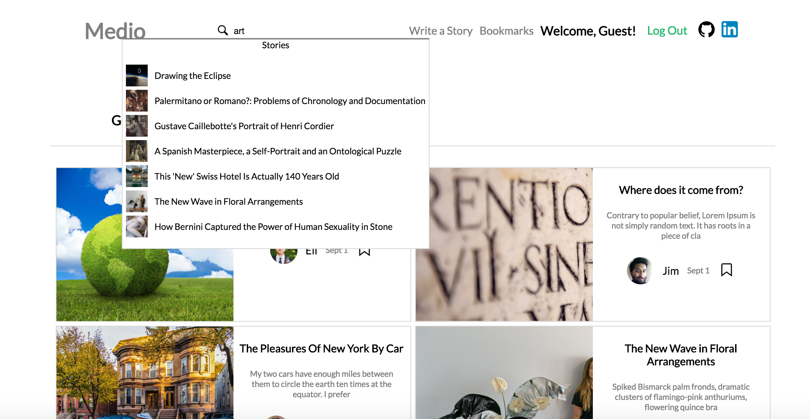

# Medio

[Medio live][heroku] 

[heroku]: http://medionews.com/

Medio is a full-stack web application inspired by Medium.  It utilizes Ruby on Rails on the backend, a PostgreSQL database, and React.js with a Redux architectural framework on the frontend.  

## Features & Implementation

### Stories and Story Index 

  At the core of Medio are the stories that users can read, create and edit. On the database side, the stories are stored in one table, which contains columns for `id`, `author_id`, `body`, `created_at` and `updated_at`. Stories each belong to one author via their `author_id` which connects to the Users table storing more detailed information about the author. 

  When navigating to the root url, stories are fetched from the Rails API and rendered on the index page filtered by category. These stories are held in the `stories` slice of state until the entire page is fully reloaded allowing for easy access to each story's information without another call to the API. In the same API call, comments are brought with each story and then stored in the `comments` slice of state. The story itself is given an array of `comment_ids` to link it to these comments.  

  The user interface of the `StoriesIndex` is meant to be seamless and easy to navigate:  


### Story Creation and Editing

  Story creation and editing are neatly joined together in the `Story Form` component where users can select a `category` and add `title`, `body` and upload a photo for their story. These photos are uploaded through the Paperclip gem and stored on Amazon Web Services. Story editing is enhanced using the Quill.js library, allowing for a more Word-processor-like experience (editing options appear by double clicking on the text). 


### Follows, Likes and Bookmarks

  The user's interaction with stories is made customizable with the addition of `follows`, `likes` and `bookmarks`. 


  Each of these features is stored as a join table in the database, with `follows` holding a `follower_id` and `followee_id`, `likes` holding a `story_id` and `user_id` and `bookmarks` holding a `story_id` and `user_id`.

  Follows allow the user to filter stories they see by author. If a user clicks an author's `follow` button, they will see stories by this author appear at the top of the index page. This follow information appears in the redux state as an array of `followee_ids` under the `currentUser` in the `session` slice of state. 

  Likes allow the user to indicate that they like the story. Users must be logged in to be able to like a story. On the story's show page, the total number of likes it has received are rendered. 

  Bookmarks allow the user to save individual stories that they would like to read later. By clicking on a story's empty bookmark image either on the index page or the story show page, a bookmark is created. A list of a users' `bookmarked_story_ids` is generated by a `has many through` relationship established by ActiveRecord associations and is stored in the redux state under the `currentUser`. Users can see all their bookmarks by clicking on the bookmarks link on the nav bar. 

### Author Pages

  Users can see basic information about any author and a list of the author's stories by going to the author's profile page. 

### Search 

  Users are able to search the database using a dropdown menu located on the nav bar. As the user enters information, the search component activates an API call querying the `stories` and `users` tables to return a list of matching results. 

  On the backend the search is facilitated using the PGSearch gem which allows for querying across multiple columns in the `stories` and `users` tables. Partial queries with matching prefixes will also be returned. 

  ```ruby
    include PgSearch

    pg_search_scope :search_for, against: %i(title body category), 
      :using => { 
        :tsearch => {:prefix => true}
      }
  ```

### Dropdowns

  To facilitate a dynamic user experience, a dropdown slice of state is employed to toggle the rendering of different dropdowns. An hash structure with each dropdown item registered as true or false was used for maximum efficiency. When a user clicks outside the dropdown, this event triggers the `clearDropdowns` action to be dispatched, flipping the dropdown values back to false. 

  ```javascript
    const defaultState = {
      searchBar: false,
      searchResults: false,
      comment_form: false, 
    };

    const DropdownsReducer = (state = defaultState, action) => {
      let nextState; 
      switch(action.type){
        case RECEIVE_DROPDOWN:
          nextState = Object.assign({}, state, action.dropdown);
          return nextState; 
        case CLEAR_DROPDOWNS:
          return defaultState; 
        default:
          return state;
      }
    }
  ```
  


## Future Directions for the Project

In addition to the features already implemented, I plan to continue work on this project.  The next steps for Medio are outlined below.

### Saved Highlights

Users can highlight a portion of text within an article and save it to a list of highlighted texts. 

### Customized Categories

Currently a user is only able to choose a category for stories they create. In the future it would be nice to add a feature allowing the user to choose categories they are particularly interested in and have these categories appear at the top of the user's home feed. 
 