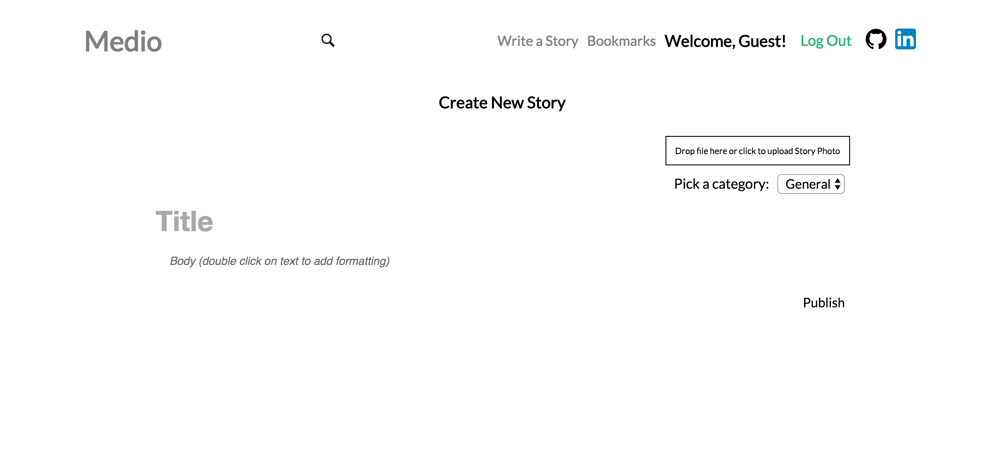

# Medio

[Medio live][heroku] 

[heroku]: https://medio.herokuapp.com/

Medio is a full-stack web application inspired by Medium.  It utilizes Ruby on Rails on the backend, a PostgreSQL database, and React.js with a Redux architectural framework on the frontend.  

## Features & Implementation

### Story Creation, Rendering and Editing

  At the core of Medio are the stories that users can read, create and edit. On the database side, the stories are stored in one table in the database, which contains columns for `id`, `author_id`, `body`, `created_at` and `updated_at`. Stories each belong to one author via their `author_id` which connects to the Users table storing more detailed information about the author. 

  Upon login, stories are fetched from the Rails API and rendered on the index page filtered by category. These stories are held in the `stories` slice of state until the entire page is fully reloaded allowing for easy access to each story's information without another call to the API. In the same API call, comments are brought with each story and then stored in the `comments` slice of state. The story itself is given an array of `comment_ids` to link it to these comments.  

  The user interface of the `StoriesIndex` is meant to be seamless and easy to navigate:  


  Story creation and editing are neatly joined together in the `Story Form` component where users can select a `category` and add `title`, `body` and upload a photo for their story. These photos are uploaded through the Paperclip gem and stored on Amazon Web Services. Story editing is enhanced using the Quill.js library, allowing for a more Word-processor-like experience. 



### Notebooks

Implementing Notebooks started with a notebook table in the database.  The `Notebook` table contains two columns: `title` and `id`.  Additionally, a `notebook_id` column was added to the `Note` table.  

The React component structure for notebooks mirrored that of notes: the `NotebookIndex` component renders a list of `CondensedNotebook`s as subcomponents, along with one `ExpandedNotebook`, kept track of by `NotebookStore.selectedNotebook()`.  

`NotebookIndex` render method:

```javascript
render: function () {
  return ({this.state.notebooks.map(function (notebook) {
    return <CondensedNotebook notebook={notebook} />
  }
  <ExpandedNotebook notebook={this.state.selectedNotebook} />)
}
```
### Search and Dropdowns


### Follows, Likes and Bookmarks

As with notebooks, tags are stored in the database through a `tag` table and a join table.  The `tag` table contains the columns `id` and `tag_name`.  The `tagged_notes` table is the associated join table, which contains three columns: `id`, `tag_id`, and `note_id`.  

Tags are maintained on the frontend in the `TagStore`.  Because creating, editing, and destroying notes can potentially affect `Tag` objects, the `NoteIndex` and the `NotebookIndex` both listen to the `TagStore`.  It was not necessary to create a `Tag` component, as tags are simply rendered as part of the individual `Note` components.  


## Future Directions for the Project

In addition to the features already implemented, I plan to continue work on this project.  The next steps for FresherNote are outlined below.

### Customized Categories

Searching notes is a standard feature of Evernote.  I plan to utilize the Fuse.js library to create a fuzzy search of notes and notebooks.  This search will look go through tags, note titles, notebook titles, and note content.  

### Direct Messaging

Although this is less essential functionality, I also plan to implement messaging between FresherNote users.  To do this, I will use WebRTC so that notifications of messages happens seamlessly.  